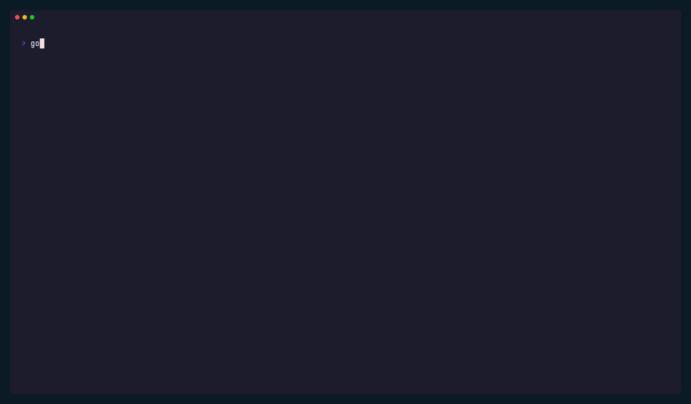

# laslig

`laslig` helps Go CLIs print structured, human-readable output with Charm-native styling and Go-idiomatic ergonomics.

The name comes from the Swedish `läslig`, meaning `legible`.



## Why

Charm already gives Go developers strong building blocks:

- Lip Gloss for styling and layout
- Fang for help, usage, and CLI error presentation

What is still missing is a narrow, reusable layer for ordinary command output: results, notices, summaries, tables, and diagnostics that should look intentional without forcing an application into a framework.

`laslig` is that layer.

## Status

The first core wave is live. Today the package includes:

- output policy and mode resolution
- a `Printer`
- sections
- notices and diagnostics
- records and lists
- tables
- panels and boxes
- the first `testjson` renderer cut for `go test -json`

The next wave is broadening `testjson`, adding more semantic blocks, and tightening the docs/examples around real developer flows such as Mage.

## Principles

- small, composable helpers instead of a framework
- writers in, errors out
- no hidden process control
- Charm-native output without depending on Fang or `charm/log`
- easy adoption in Fang, Cobra, Mage, and plain Go commands

## Non-Goals

- replacing application logging
- replacing command frameworks
- shipping interactive prompt widgets in v1
- becoming a kitchen-sink terminal toolkit

## Install

```bash
go get github.com/evanmschultz/laslig
```

## Quick Start

```go
package main

import (
	"os"

	"github.com/evanmschultz/laslig"
)

func main() {
	printer := laslig.New(os.Stdout, laslig.Policy{
		Format: laslig.FormatAuto,
		Style:  laslig.StyleAuto,
	})

	_ = printer.Section("release")
	_ = printer.Notice(laslig.Notice{
		Level: laslig.NoticeSuccessLevel,
		Title: "All checks passed",
		Body:  "The CLI can now print structured output with one small helper.",
	})
	_ = printer.Table(laslig.Table{
		Title:  "artifacts",
		Header: []string{"name", "status"},
		Rows: [][]string{
			{"darwin-arm64", "ready"},
			{"linux-amd64", "ready"},
		},
	})
}
```

## Current Surface

```go
printer.Section("Deploy")
printer.Notice(laslig.Notice{Level: laslig.NoticeWarningLevel, Title: "Partial success"})
printer.Record(laslig.Record{Title: "Build"})
printer.List(laslig.List{Title: "Packages"})
printer.Table(laslig.Table{Title: "Results"})
printer.Panel(laslig.Panel{Title: "Next step", Body: "Run mage check."})
printer.Box(laslig.Panel{Body: "Box is an alias for Panel."})
```

`FormatAuto` resolves to human output on a terminal and plain text otherwise. `StyleAuto` enables ANSI styling only when the writer is attached to a TTY.

## JSON Mode

The same primitives can render machine-readable payloads:

```go
printer := laslig.New(os.Stdout, laslig.Policy{
	Format: laslig.FormatJSON,
})
```

That makes it practical to keep one semantic output path while exposing human, plain, and JSON surfaces from the same command.

## Structured Test Output

The `testjson` subpackage parses and renders `go test -json` streams without taking over command execution:

```go
cmd := exec.Command("go", "test", "-json", "./...")
stdout, err := cmd.StdoutPipe()
if err != nil {
	return err
}
cmd.Stderr = os.Stderr

if err := cmd.Start(); err != nil {
	return err
}

summary, err := testjson.Render(os.Stdout, stdout, testjson.Options{
	Policy: laslig.Policy{
		Format: laslig.FormatAuto,
		Style:  laslig.StyleAuto,
	},
	View: testjson.ViewCompact,
})
if err != nil {
	return err
}

if err := cmd.Wait(); err != nil {
	return err
}
if summary.HasFailures() {
	return errors.New("tests failed")
}
```

That shape works well in ordinary CLIs and in Mage targets. `laslig` stays responsible for rendering, while the caller stays responsible for process control.

## Demo

The tracked demo command lives in [cmd/laslig-demo/main.go](/Users/evanschultz/Documents/Code/hylla/laslig/main/cmd/laslig-demo/main.go).

Run it locally:

```bash
mage demo
go run ./cmd/laslig-demo --format human --style always
go run ./cmd/laslig-demo --format json
```

The README GIF is generated from [docs/vhs/showcase.tape](/Users/evanschultz/Documents/Code/hylla/laslig/main/docs/vhs/showcase.tape).

## Planned Next

- broader `testjson` summaries and richer failure grouping
- more semantic blocks such as badges and dedicated key/value helpers
- Mage-oriented examples that dogfood `laslig`
- more README visuals and side-by-side comparisons

## Development

This repository uses Mage for local automation.

```bash
mage check
mage build
mage demo
mage vhs
```

README examples and terminal GIFs are generated from the tracked demo app and VHS tapes under [docs/vhs/](/Users/evanschultz/Documents/Code/hylla/laslig/main/docs/vhs).

## Plan

The tracked execution plan lives in [PLAN.md](/Users/evanschultz/Documents/Code/hylla/laslig/main/PLAN.md).
