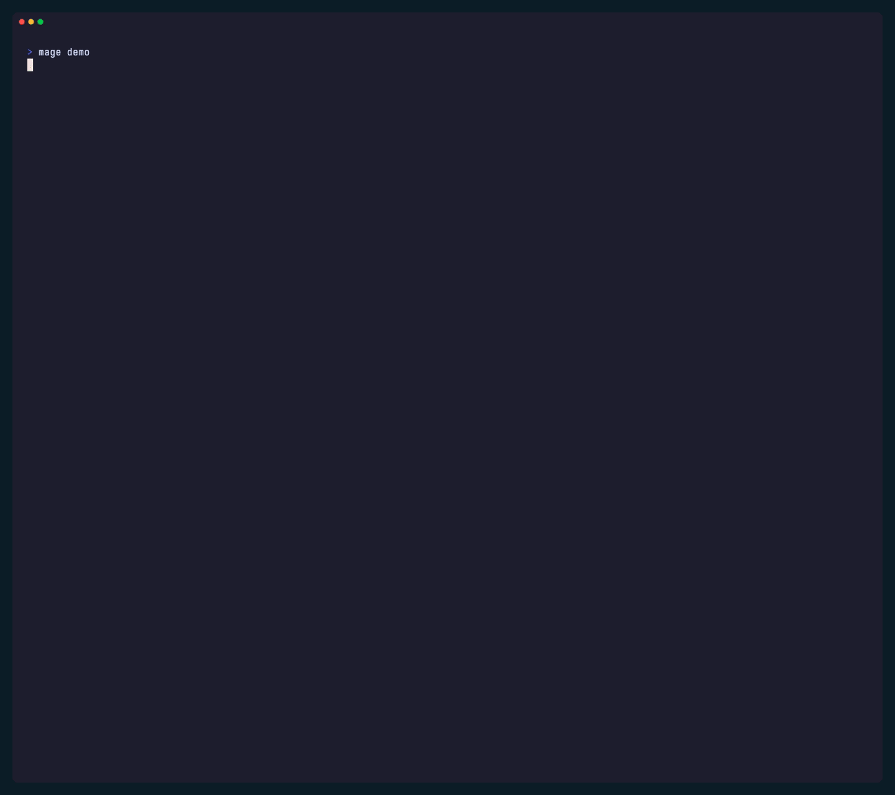
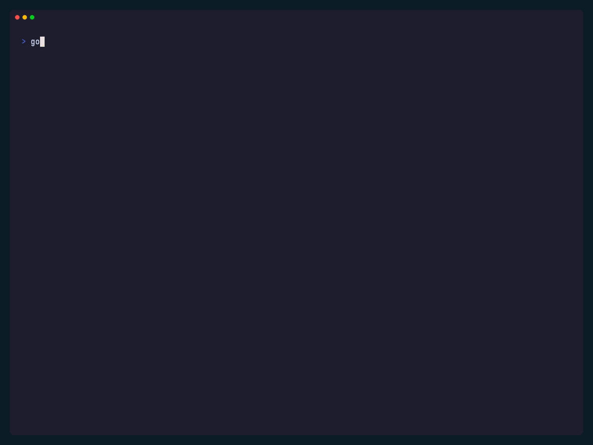
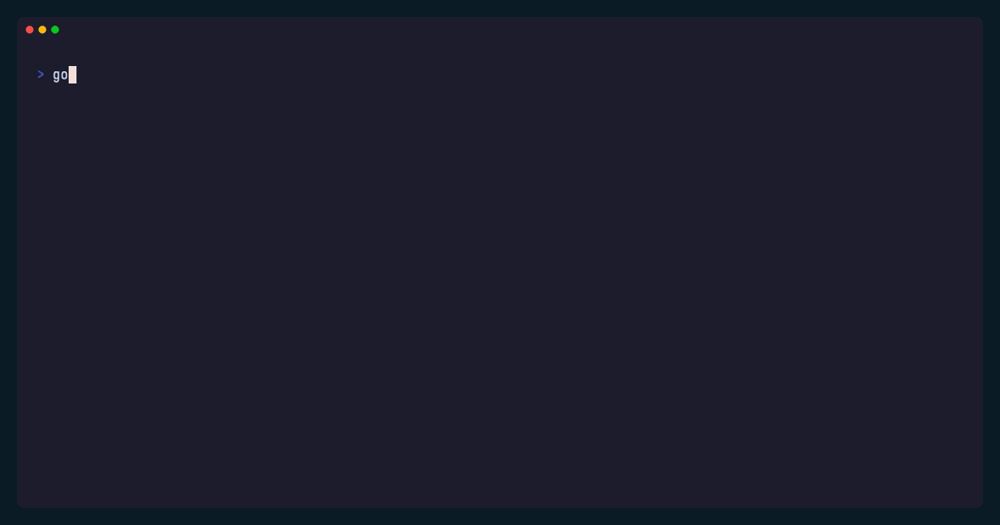
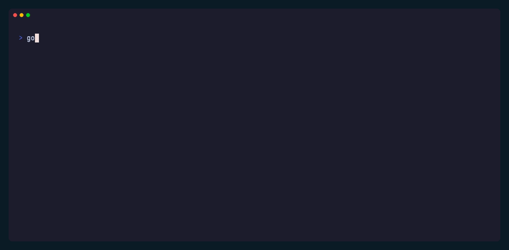
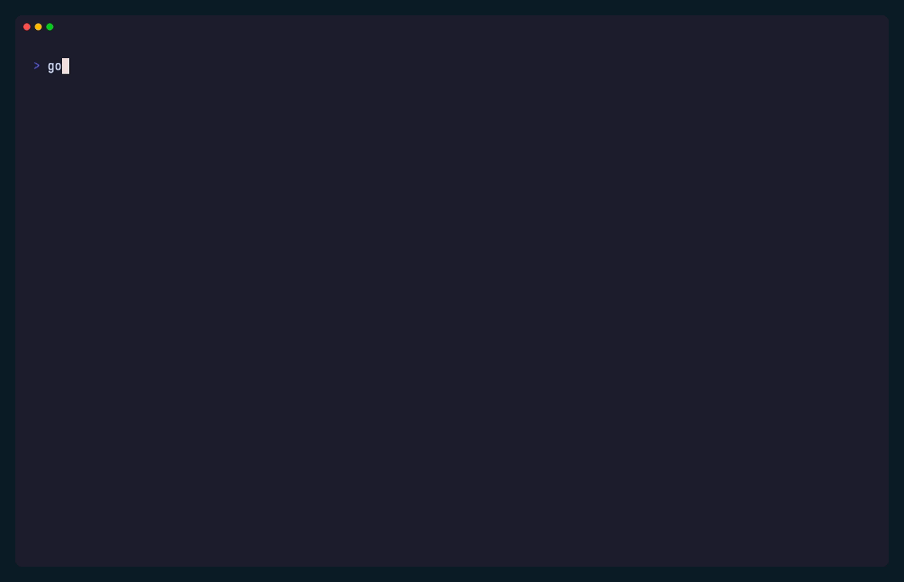
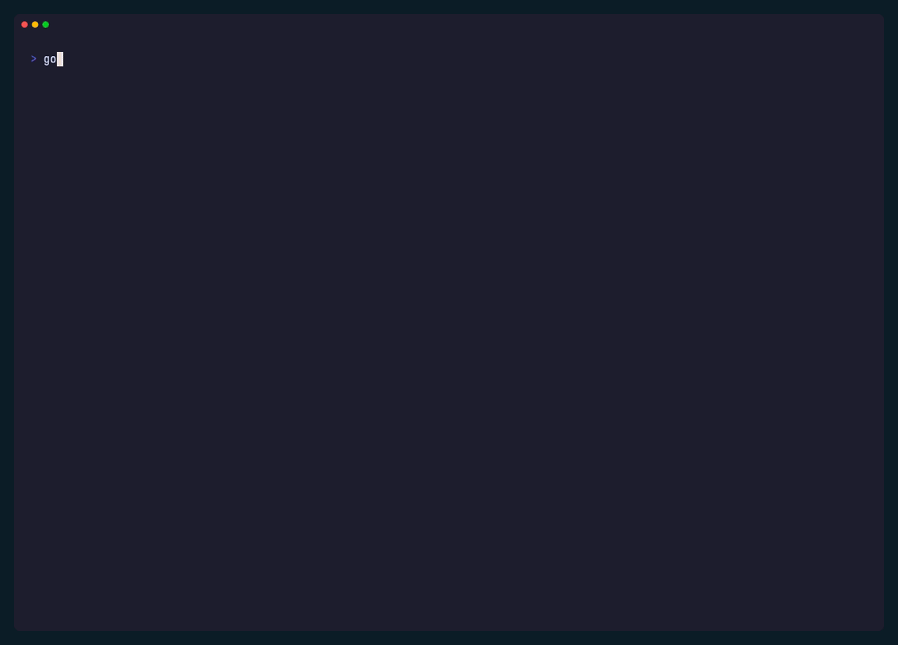
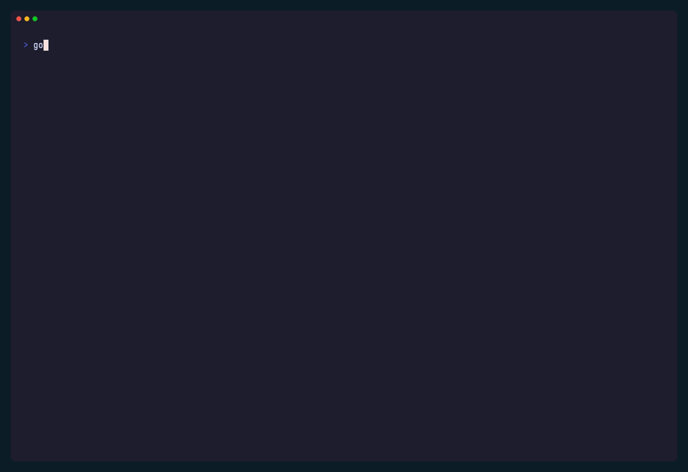
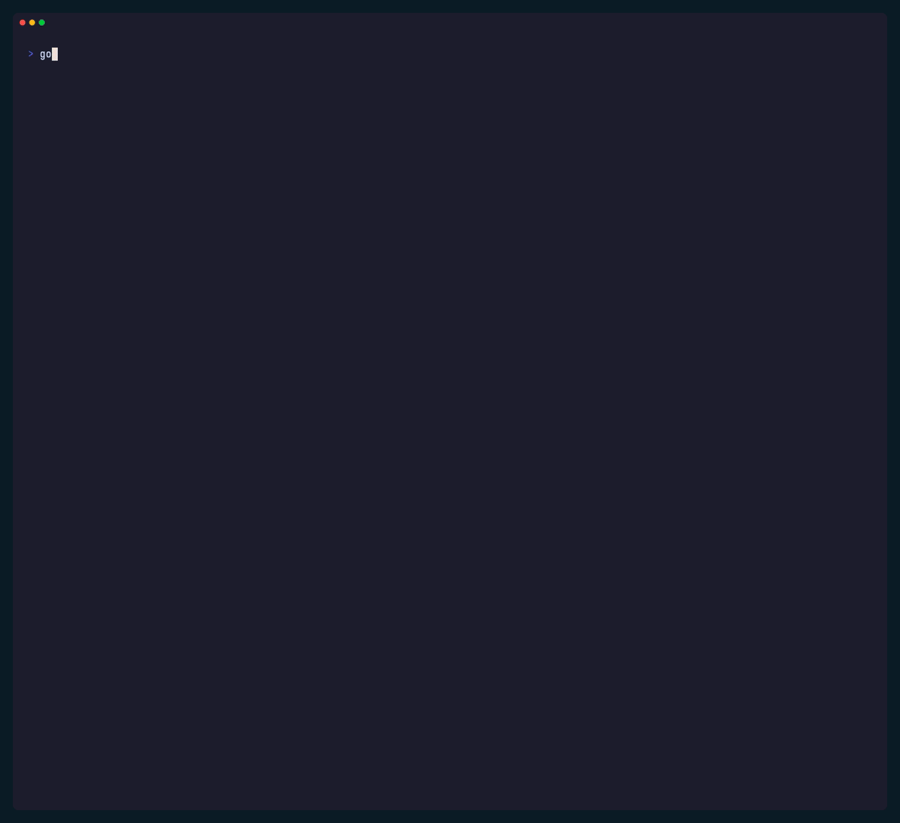
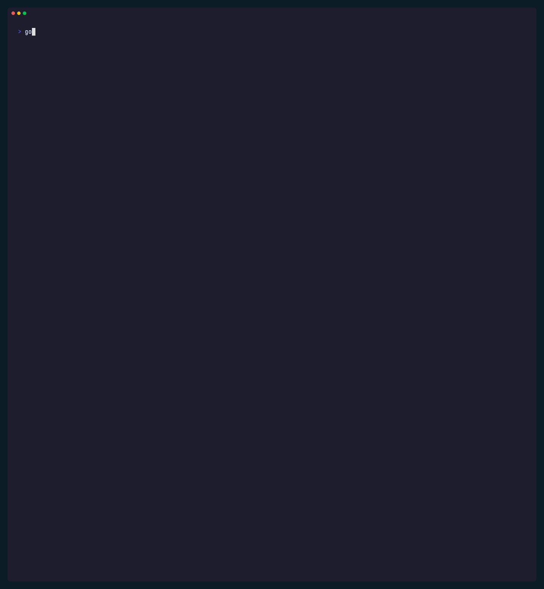

# Läslig

`laslig` helps Go CLI tools render attractive, structured terminal output with readable defaults and Go-idiomatic ergonomics.

The package and module name stay `laslig`. The product branding is `Läslig`, from the Swedish `läslig`, meaning `legible`, and is pronounced roughly `LEH-slig`.

## Visual Examples

Every guided demo item now has its own runnable example under [`examples/`](./examples) and its own focused VHS capture under [`docs/vhs/`](./docs/vhs). `mage demo` now prints those focused examples one after another as one accumulating walkthrough, with the default braille spinner bridging each example transition. The hero GIF below is a direct capture of that real `mage demo` flow, while the smaller GIFs underneath stay focused one primitive at a time.

The hero demo is intentionally slowed down between sections for README display. Läslig itself does not add runtime delays to your commands by default.

[](./examples)

Run `mage demo` for the paced aggregate walkthrough in a real terminal, or run any focused example directly with `go run ./examples/<name> --format human --style always`.

### Structured Primitives

| Section | Notice | Record |
| --- | --- | --- |
| [](./examples/section) | [](./examples/notice) | [](./examples/record) |
| [`examples/section`](./examples/section) | [`examples/notice`](./examples/notice) | [`examples/record`](./examples/record) |
| [](./examples/kv) | [](./examples/list) | [](./examples/table) |
| [`examples/kv`](./examples/kv) | [`examples/list`](./examples/list) | [`examples/table`](./examples/table) |

| Panel |
| --- |
| [](./examples/panel) |
| [`examples/panel`](./examples/panel) |

### Rich Text And Progress

| Paragraph | StatusLine | Spinner |
| --- | --- | --- |
| [](./examples/paragraph) | [](./examples/statusline) | [](./examples/spinner) |
| [`examples/paragraph`](./examples/paragraph) | [`examples/statusline`](./examples/statusline) | [`examples/spinner`](./examples/spinner) |

| Markdown | CodeBlock | LogBlock |
| --- | --- | --- |
| [](./examples/markdown) | [](./examples/codeblock) | [](./examples/logblock) |
| [`examples/markdown`](./examples/markdown) | [`examples/codeblock`](./examples/codeblock) | [`examples/logblock`](./examples/logblock) |

### Specialized Packages

| gotestout | Mage-style integration |
| --- | --- |
| [](./examples/gotestout) | [](./examples/magecheck) |
| [`examples/gotestout`](./examples/gotestout) | [`examples/magecheck`](./examples/magecheck) |

The focused `gotestout` example intentionally uses a mixed pass/skip/fail fixture so the README shows Läslig's failure rendering too. The separate Mage-style integration example shows the passing task-runner path.

## Why

Charm already gives Go developers strong building blocks:

- Lip Gloss for styling and layout
- Fang for help, usage, and CLI error presentation

What is still missing is a narrow, reusable layer for ordinary command output: results, notices, summaries, tables, warnings, and errors that should look intentional without forcing an application into a framework.

`laslig` is that layer.

## Status

Today the package includes:

- output policy and mode resolution
- document-layout defaults with caller-tunable spacing, section indentation, and list markers
- a `Printer`
- sections
- notices for info, success, warning, and error output
- records and lists
- aligned key-value blocks
- paragraph blocks
- compact status lines
- opt-in transient spinners with stable plain and JSON fallbacks
- built-in spinner styles: braille, dot, line, pulse, and meter
- tables
- panels
- Glamour-backed Markdown blocks
- Glamour-backed code blocks
- boxed log/transcript blocks for caller-provided output
- compact and detailed `gotestout` rendering for `go test -json`
- caller-tunable `gotestout` summary and output sections

Deferred for a later release:

- named theme presets and more ergonomic theme overrides on top of the shipped raw `Theme` surface
- deeper `gotestout` classification and subtest rollups
- explicit `gotestout` JSONL capture/export helpers
- any future standalone `Badge` or `Header` primitives if real use cases appear

## Principles

- small, composable helpers instead of a framework
- writers in, errors out
- no hidden process control
- attractive output without requiring Fang or `charm/log` as core library dependencies
- easy adoption in Fang, Cobra, Mage, and plain Go commands
- explicit rendering of caller-provided log excerpts without becoming a logger

## Non-Goals

- replacing application logging
- replacing command frameworks
- shipping interactive prompt widgets in v1
- becoming a kitchen-sink terminal toolkit

## Install

```bash
go get github.com/evanmschultz/laslig
```

The current minimum supported Go version is `1.25.8`.

## Quick Start

```go
package main

import (
	"os"

	"github.com/evanmschultz/laslig"
)

func main() {
	printer := laslig.New(os.Stdout, laslig.Policy{
		Format: laslig.FormatAuto,
		Style:  laslig.StyleAuto,
	})

	_ = printer.Section("release")
	_ = printer.Notice(laslig.Notice{
		Level: laslig.NoticeSuccessLevel,
		Title: "All checks passed",
		Body:  "The CLI can now print structured output with one small helper.",
	})
	_ = printer.Table(laslig.Table{
		Title:  "artifacts",
		Header: []string{"name", "status"},
		Rows: [][]string{
			{"darwin-arm64", "ready"},
			{"linux-amd64", "ready"},
		},
	})
}
```

## Current Surface

```go
printer.Section("Deploy")
printer.Notice(laslig.Notice{Level: laslig.NoticeWarningLevel, Title: "Partial success"})
printer.Record(laslig.Record{Title: "Build"})
printer.KV(laslig.KV{Title: "Config"})
printer.List(laslig.List{Title: "Packages"})
printer.Paragraph(laslig.Paragraph{Title: "Why", Body: "Readable defaults matter."})
printer.StatusLine(laslig.StatusLine{Level: laslig.NoticeSuccessLevel, Text: "Build ready"})
spin := printer.NewSpinner()
_ = spin.Start("Waiting for rollout")
_ = spin.Stop("Rollout ready", laslig.NoticeSuccessLevel)
printer.Table(laslig.Table{Title: "Results"})
printer.Panel(laslig.Panel{Title: "Next step", Body: "Run mage check."})
printer.Markdown(laslig.Markdown{Body: "# Notes\n\n- first\n- second"})
printer.CodeBlock(laslig.CodeBlock{Title: "Example", Language: "go", Body: `fmt.Println("hi")`})
printer.LogBlock(laslig.LogBlock{Title: "stderr excerpt", Body: "INFO boot complete\nWARN retry scheduled"})
```

`FormatAuto` resolves to human output on a terminal and plain text otherwise. `StyleAuto` enables ANSI styling only when the writer is attached to a TTY.

## Layout

Läslig now treats output more like a document by default:

- one leading blank line before the first rendered block
- one blank line between ordinary blocks
- stronger separation before new sections
- section-owned indentation for blocks that follow a `Section`

Commands can tune that shape when they need something flatter:

```go
layout := laslig.DefaultLayout().
	WithLeadingGap(0).
	WithSectionIndent(0).
	WithListMarker(laslig.ListMarkerBullet)

printer := laslig.New(os.Stdout, laslig.Policy{
	Format: laslig.FormatAuto,
	Style:  laslig.StyleAuto,
	Layout: &layout,
})
```

`Policy` can also carry a raw `Theme` override when one command wants to swap
the default styles directly. Higher-level theme presets are still deferred
for a later release.

Markdown and code blocks render through Glamour and default to its `dracula`
preset. Commands can override that with `Policy.GlamourStyle`.

## JSON Mode

The same primitives can render machine-readable payloads:

```go
printer := laslig.New(os.Stdout, laslig.Policy{
	Format: laslig.FormatJSON,
})
```

That makes it practical to keep one semantic output path while exposing human, plain, and JSON surfaces from the same command.

## Rich Text, Code, And Logs

`laslig` can now render wrapped prose, Markdown, code, and caller-provided log excerpts without taking over logging itself:

```go
_ = printer.Paragraph(laslig.Paragraph{
	Title:  "Why",
	Body:   "Readable long-form CLI output should not require a hand-built Lip Gloss layout every time.",
	Footer: "Writers in, errors out.",
})

_ = printer.StatusLine(laslig.StatusLine{
	Level:  laslig.NoticeSuccessLevel,
	Text:   "Build ready",
	Detail: "mage check",
})

spin := printer.NewSpinner()
_ = spin.Start("Waiting for remote rollout")
_ = spin.Stop("Rollout ready", laslig.NoticeSuccessLevel)

_ = printer.Markdown(laslig.Markdown{
	Body: "# Release Notes\n\n## Highlights\n\n- one renderer\n- three output surfaces",
})

_ = printer.CodeBlock(laslig.CodeBlock{
	Title:    "example.go",
	Language: "go",
	Body:     `fmt.Println("hello from laslig")`,
	Footer:   "Rendered through Glamour for terminal output.",
})

_ = printer.LogBlock(laslig.LogBlock{
	Title: "stderr excerpt",
	Body:  "INFO boot complete\nWARN retry scheduled\nERROR dependency missing",
})
```

`Markdown` and `CodeBlock` use Glamour for rich terminal rendering when styled human output is active. `LogBlock` is for explicit caller-provided excerpts, transcripts, and stderr captures. `laslig` still does not replace the application's logger.

Use `Spinner` only when work may otherwise be silent for several seconds. For
short operations, a durable `StatusLine` or `Notice` is usually clearer.
Built-in spinner styles are `braille`, `dot`, `line`, `pulse`, and `meter`.
The default is `braille`. Set `Policy.SpinnerStyle` for a printer-wide default
or call `printer.NewSpinnerWithStyle(...)` for one explicit spinner instance.

## Structured Test Output

The `gotestout` subpackage parses and renders `go test -json` streams without taking over command execution:

```go
import (
	"errors"
	"os"
	"os/exec"

	"github.com/evanmschultz/laslig"
	"github.com/evanmschultz/laslig/gotestout"
)

cmd := exec.Command("go", "test", "-json", "./...")
stdout, err := cmd.StdoutPipe()
if err != nil {
	return err
}
cmd.Stderr = os.Stderr

if err := cmd.Start(); err != nil {
	return err
}

summary, err := gotestout.Render(os.Stdout, stdout, gotestout.Options{
	Policy: laslig.Policy{
		Format: laslig.FormatAuto,
		Style:  laslig.StyleAuto,
	},
	View: gotestout.ViewCompact,
	DisabledSections: []gotestout.Section{
		gotestout.SectionSkippedTests,
	},
})
if err != nil {
	return err
}

if err := cmd.Wait(); err != nil {
	return err
}
if summary.HasFailures() {
	return errors.New("tests failed")
}
```

That shape works well in ordinary Go CLIs, Mage targets, Cobra/Fang commands, and small Go helpers invoked from tools like `make`, `just`, or `task`. `laslig` stays responsible for rendering, while the caller stays responsible for process control. Callers can also disable grouped failed-test, skipped-test, package-error, or captured-output sections when they want a tighter stream.

`gotestout` also supports one spinner-only live activity footer for active test
streams. The footer defaults to `auto`, which means styled human terminal
output gets one transient spinner line while the stream is active, while plain,
unstyled human, and JSON output stay stable and non-transient. Callers can
force that footer on with `gotestout.ActivityOn` for demos or disable it
entirely with `gotestout.ActivityOff`.

This repository dogfoods that pattern in [`magefiles/magefile.go`](./magefiles/magefile.go): `mage test` runs `go test -json ./...`, renders compact package and failure output through `gotestout`, and still returns a normal Mage error on failure.
The focused runnable example for that package lives in [`examples/gotestout/main.go`](./examples/gotestout/main.go).
The separate Mage-facing example in [`examples/magecheck/main.go`](./examples/magecheck/main.go) shows the same passing task-runner path with `gotestout`'s live activity footer enabled while the test stream is active.

Common ways to try that surface locally:

```bash
go run ./examples/gotestout --format human --style always
mage test
```

The focused `gotestout` GIF and example command intentionally include passing,
skipped, and failing test events plus one package build failure. The separate
`magecheck` GIF shows the passing task-runner path with the live activity
footer active during the running stream. That keeps the README honest about
both the success path and the failure path.

Future `gotestout` work is about smarter summaries, not basic
functionality: clearer buckets for test failures vs package/build failures,
subtest-aware rollups, and better handling for noisy captured output.

## Demo

Focused runnable examples now live one-per-item under [`examples/`](./examples): `section`, `notice`, `record`, `kv`, `list`, `table`, `panel`, `paragraph`, `statusline`, `spinner`, `markdown`, `codeblock`, `logblock`, `gotestout`, and `magecheck`.
The aggregate walkthrough renderer also lives in [`examples/all/main.go`](./examples/all/main.go).
The focused `logblock` example captures real `charm.land/log/v2` output internally so the demo still shows an actual Charm log transcript without making `charm/log` part of laslig's public API.
Small verified Go doc examples live in [`example_test.go`](./example_test.go).
`mage demo` is the paced walkthrough entrypoint. It renders the focused examples one after another as one accumulating document, using the default braille spinner between examples so the walkthrough never pauses silently. `examples/all` remains the aggregate renderer for direct example runs and tests.

Run it locally:

```bash
mage demo
go run ./examples/section --format human --style always
go run ./examples/notice --format human --style always
go run ./examples/spinner --format human --style always
go run ./examples/gotestout --format human --style always
go run ./examples/magecheck --format human --style always
go run ./examples/all --format human --style always
mage test
```

`mage demo` is the normal paced walkthrough entrypoint. `mage test` is the real Mage-facing `gotestout` dogfood path. The `magecheck` focused example demonstrates the live activity footer during the running test stream. The `go run` forms above show the focused per-item examples directly, while `go run ./examples/all` renders the aggregate example without the paced demo wrapper.

The README GIFs are generated from the focused VHS tapes under [`docs/vhs/`](./docs/vhs). `mage vhs` renders all tracked tapes so the README stays aligned with the runnable examples.

## Deferred

- theme presets and higher-level theme configuration
- richer `gotestout` failure classification and subtest rollups
- explicit `gotestout` JSONL capture/export helpers
- future standalone `Badge` or `Header` primitives only if real use cases appear

## Development

This repository uses Mage for local automation.

Install the same Mage version used in CI:

```bash
go install github.com/magefile/mage@v1.17.0
```

```bash
mage check
mage test
mage build
mage demo
mage vhs
```

See [`CONTRIBUTING.md`](./CONTRIBUTING.md) for contributor workflow details and [`SECURITY.md`](./SECURITY.md) for vulnerability reporting guidance.

Structural terminal output is also covered by Charm `x/exp/golden` snapshots in the shared example renderer, the aggregate demo, the focused `gotestout` demo, and the `gotestout` package. Update them intentionally with:

```bash
go test ./internal/examples -args -update
go test ./examples/all -args -update
go test ./examples/gotestout -args -update
go test ./gotestout -run 'TestRenderPlainCompactGolden|TestRenderHumanStyledCompactGolden' -args -update
```

README examples and terminal GIFs are generated from the focused runnable demos under [`examples/`](./examples) and the tracked VHS tapes under [`docs/vhs/`](./docs/vhs).

## License

`laslig` is licensed under [Apache-2.0](./LICENSE).

## Plan

The tracked execution plan lives in [`PLAN.md`](./PLAN.md).
